APPGATE TECHINICAL TEST
========================

***** SYSADMIN *****
--------------------

Usted está a cargo de un sistema basado en microservicios en JAVA, con conexiones de base de datos en MongoDB, intercambio de
mensajes con brokers de Kafka y RabbitMQ, y comunicándose por medio de servicios Restful. ¿Que métricas usted considera críticas para monitorear en el sistema y con qué herramientas lo ejecutaría?, justifique su respuesta.

**Respuesta:**

**1. Java/MongoDB**

Existen diferentes herramientas sobre las cuales se podría realizar un monitoreo de performance de aplicaciones java contenerizadas en microservicios. Usualmente he trabajo con Dynatrace, CA APM y Newrelic.  Para este caso me voy a enforcar en como realizarlo con NewRelic:

Procedimiento:

Este es un ejemplo de parámetros de configuración que se deberían agregar sobre el archivo Dockerfile con el cual se están desplegando los microservicios java. Básicamente se deben agregar las siguientes líneas:

```python
RUN mkdir -p /usr/local/tomcat/newrelic
ADD ./newrelic/newrelic.jar /usr/local/tomcat/newrelic/newrelic.jar
ENV JAVA_OPTS="$JAVA_OPTS -javaagent:/usr/local/tomcat/newrelic/newrelic.jar -Dnewrelic.config.app_name='MY_APP_NAME'"
ADD ./newrelic/newrelic.yml /usr/local/tomcat/newrelic/newrelic.yml
```

Dada esta configuración, se podrían obtener las siguientes métricas en consola:

- % Memory heap used
- Average response time (ms) / APP
- Invocations per interval / APP
- Error per interval / APP
- SQL queries responses / APP
- NoSQL queries responses / APP

**2. Kafka**

Para monitorear Kafka, se pueden capturar sus métricas con "Prometheus" a través de "JmxExporter" y a su vez se puede realizar una integración  con newrelic o dynatrace y así obtener todos los beneficios de Newrelic hub, logrando tener un monitoreo end-to-end al tener ya instalado el agente para java sobre docker. Las métricas que se podrían llegar a obtener son:

- Network Request Rate
- Network Error Rate
- Under-replicated Partitions
- Offline Partition Count
- Total Broker Partitions
- Log Flush Latency
- Consumer Message Rate
- Consumer Max Lag

**3. RabitMQ**

Existe un plugin de Newrelic que puede ser utilizado para capturar diferentes métricas de RabitMQ. Las métricas podrían ser:

- connectionsBlocked (Number of current connections in the state blocked)
- connectionsBlocking (Number of current connections in the state blocking)
- connectionsClosed (Number of current connections in the state closed)
- connectionsClosing (Number of current connections in the state closing)
- connectionsFlow (Number of current connections in the state flow)
- connectionsOpening (Number of current connections in the state opening)
- connectionsRunning (Number of current connections in the state running)
- connectionsStarting (Number of current connections in the state starting)
- connectionsTotal (Number of current connections to a given rabbitmq vhost)

**Nota:** Se podría configurar un scale up a partir de la métrica de Queue size.

***** NETWORKING + SYSADMIN + CLOUD *****
-----------------------------------------

**1. Cluster kubernetes**
-------------------------

- Network CIDR: 10.100.0.0/19
- Subnet CIDRs: 
  - 10.100.0.0/21 (10.100.0.0/22 + 10.100.4.0/22)
  - 10.100.8.0/21 (10.100.8.0/22 + 10.100.12.0/22)
  - 10.100.16.0/22
  - 10.100.20.0/22
  - 10.100.24.0/22
  - 10.100.28.0/22

  ***Nota:*** Según mi interpretación de la necesidad de este punto, se necesitan definir 6 subredes, pero básicamente si hago un subneteo obtengo 8 subredes, por lo cual
  para no desperdiciar ninguna ip tal y como lo solicitan, agrupe dos subnetes en una 2 veces y así evito tener desperdicio de ips.

- AWS Region: us-east-2
- Instance Types = m5.large
- Capacity Type = spot
- Autoscaler desired capacity = 3
- Autoscaler min capacity = 3
- Autoscaler max capacity = 3

**Arquitectura**


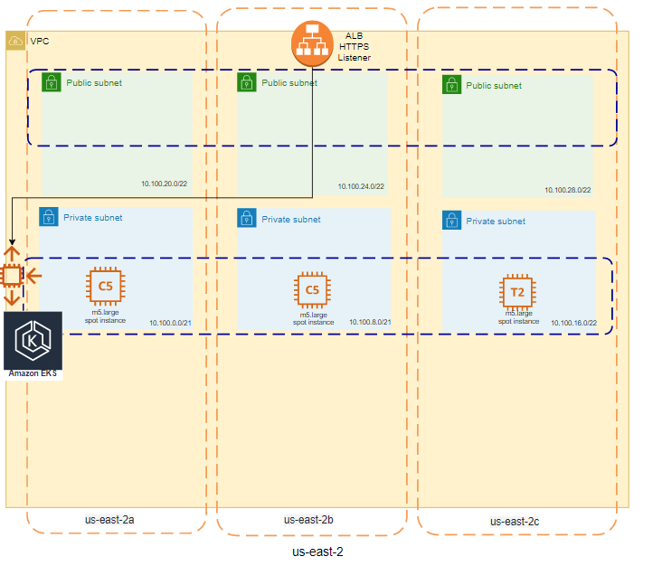


**Despliegue**

**-Via eksctl**

**1.** Crear el archivo de configuración "appgate-cluster.yaml"

```yaml
apiVersion: eksctl.io/v1alpha5
kind: ClusterConfig

metadata:
  name: private-cluster
  region: us-east-2

privateCluster:
  enabled: true
  additionalEndpointServices:
  - "autoscaling"

vpc:
  subnets:
    private:
      us-east-2a:
        id: <subnet-id>
      us-east-2b:
        id: <subnet-id>
      us-east-2c:
        id: <subnet-id>

managedNodeGroups:
- name: ng1
  capacityType: SPOT
  instanceType: m5.large
  desiredCapacity: 3
  privateNetworking: true
```

**2.** Crear el cluster utilizando el comando eksctl

```python
eksctl create cluster --config-file appgate-cluster.yaml
```

##

**-Vía terraform**

**1.** Crear el archivo main.tf: 

```terraform
resource "aws_eks_node_group" "example" {
  cluster_name    = aws_eks_cluster.example.name
  node_group_name = "example"
  node_role_arn   = aws_iam_role.example.arn
  subnet_ids      = aws_subnet.example[*].id
  instance_types  = ["m5.large"]
  capacity_type   = "SPOT"

  scaling_config {
    desired_size = 3
    max_size     = 3
    min_size     = 3
  }

  depends_on = [
    aws_iam_role_policy_attachment.example-AmazonEKSWorkerNodePolicy,
    aws_iam_role_policy_attachment.example-AmazonEKS_CNI_Policy,
    aws_iam_role_policy_attachment.example-AmazonEC2ContainerRegistryReadOnly,
  ]

  lifecycle {
    ignore_changes = [scaling_config[0].desired_size]
  }
}

```

**2.** Desplegar el cluster utlizando el siguiente comando:

```terraform
terraform init
terraform apply
```

##

**Nota:** Los ejemplos de despliegue anteriormente presentados no contienen la totalidad del código necesario para realizar el despliegue, pero estoy mostrando

##

**2. Ejercicio Subnets**
--------------------------------------

Se dispone de una red 10.100.32.0/22 para servicios, se debe crear 4 subredes las cuales contienen (1 productiva, 1 Testting and QA,
y 2 para BCP y/o crecimiento). Cada subred debe estar distribuido mínimo en 3 zonas de zonas sin desperdicio de IPs, 3 subredes para
segmentos públicos y 3 para segmentos privados.

**Respuesta:**

Según mi interpretación, entiendo que deberían generarse 4 subredes (por cada ambiente) y adicionalmente que por cada uno deberian haber 6 subredes (3 públicas y 3 privadas) por ambiente y que a su vez cada subred debe distribuirse en 3 AZs, por lo cual el calculó 4 x 6 x 3 = 72. De tal forma que las subredes que se deberían generar a partir de al red
10.100.32.0/22 serían las siguintes:

```text
10.100.32.0/28
10.100.32.16/28
10.100.32.32/28
10.100.32.48/28
10.100.32.64/28
10.100.32.80/28
10.100.32.96/28
10.100.32.112/28
10.100.32.128/28
10.100.32.144/28
10.100.32.160/28
10.100.32.176/28
10.100.32.192/28
10.100.32.208/28
10.100.32.224/28
10.100.32.240/28
10.100.33.0/28
10.100.33.16/28
10.100.33.32/28
10.100.33.48/28
10.100.33.64/28
10.100.33.80/28
10.100.33.96/28
10.100.33.112/28
10.100.33.128/28
10.100.33.144/28
10.100.33.160/28
10.100.33.176/28
10.100.33.192/28
10.100.33.208/28
10.100.33.224/28
10.100.33.240/28
10.100.34.0/28
10.100.34.16/28
10.100.34.32/28
10.100.34.48/28
10.100.34.64/28
10.100.34.80/28
10.100.34.96/28
10.100.34.112/28
10.100.34.128/28
10.100.34.144/28
10.100.34.160/28
10.100.34.176/28
10.100.34.192/28
10.100.34.208/28
10.100.34.224/28
10.100.34.240/28
10.100.35.0/28
10.100.35.16/28
10.100.35.32/28
10.100.35.32/28
10.100.35.64/28
10.100.35.80/28
10.100.35.96/28
10.100.35.112/28
10.100.35.127/29
10.100.35.135/29
10.100.35.143/29
10.100.35.151/29
10.100.35.159/29
10.100.35.167/29
10.100.35.175/29
10.100.35.183/29
10.100.35.191/29
10.100.35.199/29
10.100.35.215/29
10.100.35.223/29
10.100.35.231/29
10.100.35.239/29
10.100.35.247/29
10.100.35.255/29
```
En donde finalmente la mitad serían públicas y la otra mitas de subredes para segmentos privados.

**Nota:** Creo que el texto no es totalmente claro y se puede presentar para tener diferentes interpretaciones.

##

**3. Una base de datos en PostgreSQL**
--------------------------------------

Características RDS:

- Instance node type  : db.m5.large
- Deployment type     : multi-az
- Storage type        : gp2
- Allocated storage   : 500 GB

**Despliegue:**

Para realizar el despliegue de esta RDS, tengo un repo de ejemplo que construí en algún momento con terraform. Comparto aquí el link de mi repo público:

https://gitlab.com/jaamarti/tf-modules/-/tree/main/tf-rds


##

**4. Un clúster de Kafka**
--------------------------

Características de Amazon Managed Streaming for Apache Kafka (Amazon MSK):

- Broker nodes                : 2
- Broker node types           : m5.large
- Storage size                : 1 TB
- Inbound Data Transfer       : 1 TB / month
- Intra-Region Data Transfer  : 1 TB / month
- Outbound Data Transfer      : 1 TB / month

##

**5. Un clúster de MongoDB**
--------------------------

Apesar que no hay un servicio exacto de cluster mongoDB, en una colaboración entre AWS y MongoDB, se generaron una serie de templates tanto de instalación de MongoDB
como de los recursos aws que soportan el cluster y que se despliegan con cloudformation. El repositorio que tiene el código para hacer este despliegue es el siguiente:

https://github.com/aws-quickstart/quickstart-mongodb

La arquitectura propuesta es la siguiente:

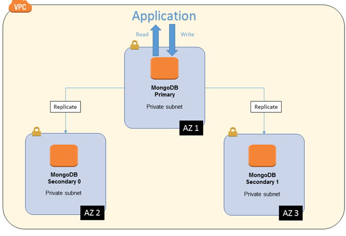

**Características:**

- Cantidad instancias ec2     : 3
- Tipo de instancias          : m5.large
- Tipo de almacenamiento      : Provisioned IOPS SSD (io1)
- Tipo de capacidad           : Reserved instance
- Tamaño almacenamiento / nodo: 500 GB

##

**6. 4 nodos EC2 que contiene servicios**

**Características:**

- Cantidad instancias ec2     : 4
- Tipo de instancias          : m6g.2xlarge
- Tipo de almacenamiento      : gp2
- Tipo de capacidad           : SPOT
- Tamaño almacenamiento / nodo: 500 GB

Para este servicio yo esperaría que los servicios pudieran detenerse e iniciar en cualquier instante de tiempo, de tal forma que fuera posible utilizar instancias 
tipo spot y adicionalmente esperaría poder tener un ASG que me ayudara a liberar y eliminar inistancias que no estuvieran siendo realmente utilizadas.

**Despliegue:**

Tengo un repositorio con código terraform que en algún momento cree para desplegar instancias EC2 con base a una ami asociadas a un launch template 
y a un Auto scaling group:

https://gitlab.com/jaamarti/tf-modules/-/tree/main/tf-ec2


##
##

**Tiempo de implementación:**

Teniendo en cuenta que los recursos podrían ser desplegados por medio de cloudformation o terraform, e incluso podrían estar asociados a un pipeline para 
asegurar un correcto CI/CD, el tiempo de implementación para crear el código (IAC) con una documentación adecuada, sería:

- Un clúster de Kubernetes (Contiene el backend y frontend)   -> 24 horas
- Un clúster de Kafka                                         -> 8  horas     
- Una base de datos en PostgreSQL (RDS o EC2)                 -> 4  horas
- Un clúster de MongoDB                                       -> 16 horas
- 4 nodos EC2 que contiene servicios.                         -> 4  horas

**Total:* 56 horas.

***Nota:*** Esa estimación de tiempo se daría porque básicamente se usaría para crear modulos completos y bien documentados de código que podría ser totalmente
reusable en cualquier instante de tiempo en el futuro y que con un simple comando de apply podría llegar a utilizarse y a desplegar los servicios deseados.


**Costo de implementación:**

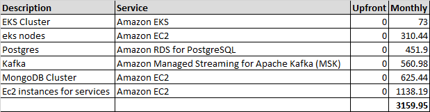


Los costos los calculé desde la herramienta oficial de AWS. Comparto el link que contiene esta estimacion y en donde se podrán observar los detalles de cada 
servicio discrimiado por plataforma:

https://calculator.aws/#/estimate?id=53a7744642f7adbd1421c28b93df48527e76839b


##


******* DOCKER + TROUBLESHOOTING *******
----------------------------------------

Componentes desplegados en docker fueron los siguientes:

- haproxy
- gunicorn
- flask app

Los archivos de código utilizados (ya corregidos) son los siguientes:

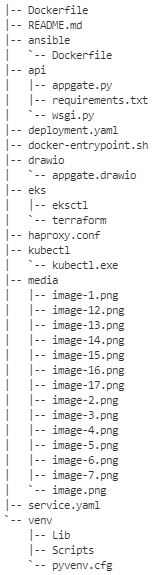

**- Dockerfile**

```python
FROM alpine
RUN apk add py3-pip build-base python3-dev libffi-dev openssl-dev haproxy
RUN mkdir -p /opt/api
WORKDIR /opt/api
ADD api/requirements.txt /opt/api
RUN pip3 install --no-cache-dir -r requirements.txt
ADD api/. /opt/api
ADD ./docker-entrypoint.sh /bin/docker-entrypoint
ADD ./haproxy.conf /etc/haproxy/haproxy.cfg
EXPOSE 80
CMD /bin/docker-entrypoint;haproxy -f "/etc/haproxy/haproxy.cfg"
HEALTHCHECK CMD wget -nv -t1 --spider 'http://localhost/' || exit 1
```
**Correcciones/mejoras:**
- Agregué el paquete "haproxy" a los paquetes que se deen instalar con apk
- Definí el inicio del balanceador como la última instrucción del CMD sin el "&" de tal manera que puediera asegurar que el contenedor seguiera ejecutandose
- agregué un HEALTHCHECK para poder capurar en cualquier instante de tiempo el estado del contenedor

##

**- haproxy.conf**
```python
global
   maxconn 8192

defaults
   log stdout format raw local0
   mode http
   option httplog
   option forwardfor
   option httpclose
   option dontlognull

   timeout connect 10s
   timeout client 150s
   timeout server 150s

   maxconn 8192

frontend app-http
   bind *:80

   acl is_app path_beg -i /
   use_backend flask_backend if is_app

backend flask_backend
   server docker-app 127.0.0.1:9000 check verify none
```

**Correcciones/mejoras:**
- Modifiqué el hostname del backend con la ip lookup 127.0.0.1 de tal forma que se puediera evitar el error de no resolución de dns.
- Removí la declaración de los archivos de error. A este punto simplemente es un workaround porque finalmente la solución final es asegurar que existan estos archivos.

##

**- /api/docker-entrypoint.sh**   (script de inicio)

```shell
#!/bin/sh
echo "Starting gunicorn..."
gunicorn -w 5 -b 127.0.0.1:9000 appgate:app --daemon
sleep 3
```

**Correcciones/mejoras:**
- Corregí el texto de los "echo"
- Retiré el llamado del haproxy y lo puse como una instrucción aparte para que el contenedor no terminara despues de ejecutar el script sino que por el contrario continuara
  corriendo y el log del contenedor fuera finalmente el output del balancedor haproxy.

##

**- /api/appgate.py**  (código de aplicación backend de flask)

```python
from flask import Flask, jsonify

app = Flask(__name__)

@app.route('/', methods=['GET'])
def hello():
    return "<h1 style='color:blue'>Hello! This is Appgate world!</h1>"

if __name__ == '__main__':
```

**Correcciones/mejoras:**
- Este archivo lo agregué por completo y básicamente tenero una respuesta html ante la invocación de la aplicación al seleccionar la ruta "/"

##

**- /api/wsgi.py**  (código de aplicación backend de flask)
```python
from appgate import app

if __name__ == "__main__":
        app.run()
```

**Correcciones/mejoras:**
- Este archivo lo agregué para hacer un import de la aplicación "app" y sirve como integración con gunicorn

##


**Procedimiento despliegue docker:**

**1.** Compilación imagen utilizando el dockerfile
```python
docker build -t appgate  .
```

**Nota:** Adicionalmente hice un push de esta nueva imagen a un registry personal público en Dockerhub (https://hub.docker.com/r/jaamarti/appgate/tags)

**2.** Lanzamiento de contenedor:
```python
docker run -itd --publish 6060:80 appgate
```

**3.** Listado contenedores activos:
```python
docker ps
```
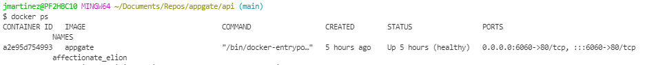

**4.** Revisión de estado health check
```python
docker inspect --format='{{json .State.Health}}' a2e95d754993
```
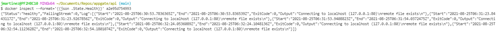

**5.** Front end "hello world appgate"

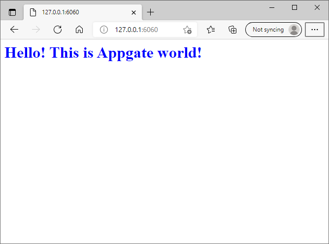

##

**Manejo de Logs**

Para manejar los logs básicamente yo desplegaría los siguientes componentes:

- Kibana
- Elastic Search
- Logstash

El trabajo se concentraría inicialmente en la configuración de logstash para la captura de los respectivos archivos logs, el cual
se debería hacer con una directiva de tipo "file" en el input, como por ejemplo:

```json
input {
  file {
    path => "/tmp/access_log"
    start_position => "beginning"
  }
}
```

Despues definiría expresiones en kibana para capturar indices y así realizar los dashboard y el analisis de data necesario con Kibana. Adicionalmente podría
utilizar otras herramientas que he usado en el pasado com IBM Log Analysis o Logmon de CA UIM.

##
##

***** KUBERNETES *****
----------------------

Este punto lo realicé utilizando localmente las siguientes aplicaciones:

- Minikube
- Helm
- Tree
- Python
- Kubectl
- Docker Desktop
- Prometheus + Graphana

**1.** Creación archivo despliegue "deployment.yaml":

```yaml
apiVersion: apps/v1
kind: Deployment
metadata:
  labels:
    app.kubernetes.io/name: load-balancer-appgate
  name: appgate
spec:
  replicas: 1
  selector:
    matchLabels:
      app.kubernetes.io/name: load-balancer-appgate
  template:
    metadata:
      labels:
        app.kubernetes.io/name: load-balancer-appgate
    spec:
      containers:
        - image: docker.io/jaamarti/appgate:v1
          name: appgate
          imagePullPolicy: Always
          ports:
          - containerPort: 80
          readinessProbe:
            tcpSocket:
              port: 80
            initialDelaySeconds: 5
            periodSeconds: 10
```

**Nota:** la imagen utilizada es una imagen que subí a mi registry en dockerhub

##

**2.** Ejecución comando de despliegue:

```python
kubectl apply -f deployment.yaml
```

##

**3.** Comando verficación despliegue:

```python
kubectl get deployment
```
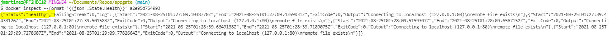

##

**4.** Creación de la definición del servicio "service.yaml":

```yaml
apiVersion: v1
kind: Service
metadata:
  creationTimestamp: "2021-08-26T00:59:49Z"      
  labels:
    app.kubernetes.io/name: load-balancer-appgate
  name: appgate-service
  namespace: default
  resourceVersion: "63013"
  uid: ed63b818-3340-423b-a650-e577b6522e10      
spec:
  clusterIP: 10.105.210.183
  clusterIPs:
  - 10.105.210.183
  externalTrafficPolicy: Cluster
  ipFamilies:
  - IPv4
  ipFamilyPolicy: SingleStack
  ports:
  - nodePort: 30790
    port: 5000
    protocol: TCP
    targetPort: 80
  selector:
    app.kubernetes.io/name: load-balancer-appgate
  sessionAffinity: None
  type: LoadBalancer
status:
  loadBalancer:
    ingress:
    - ip: 127.0.0.1
```
##

**5.** Ejecución comando de despliegue:

```python
kubectl apply -f service.yaml
```

Adicionalmente podría crear mi servicio sin utilizar el manifiesto anterior simplemente ejecutando el siguiente comando:

```python
kubectl expose deployment appgate --type=LoadBalancer --port=5000 --target-port=80 --protocol=TCP --name=appgate-service
```

##

**5.** Verificación del servicio desplegado:

```python
kubectl get service
```

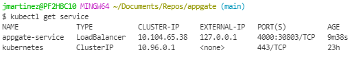

##

**7.** Verificación de frontend de app corriendo sobre kubernetes:

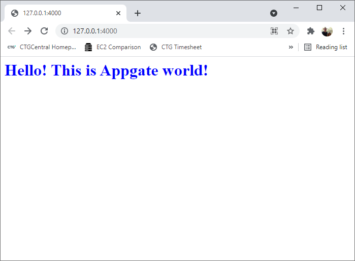

##

**8.** Instalé "helm" para win10

```python
kubectl port-forward -n prometheus prometheus-grafana
```
##

**9.** Creación namespace prometheus:

```python
kubectl create namespace prometheus
```
##

**10.** Instalación de prometheus y graphana:

```python
helm install prometheus stable/prometheus-operator --namespace prometheus
```
##

**11.** Verificación del despliegue:

```python
kubectl get pods -n prometheus
```
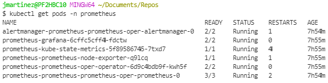

##

**12.** Exponer servicio prometheus:

```python
kubectl port-forward -n prometheus prometheus-prometheus-prometheus-oper-prometheus-0 9090
```
##

**13.** Exponer servicio Graphana:

```python
kubectl port-forward -n prometheus prometheus-grafana-5c5885d488-b9mlj 3000
```
##

**13.** Verificación de dashboards grapaha

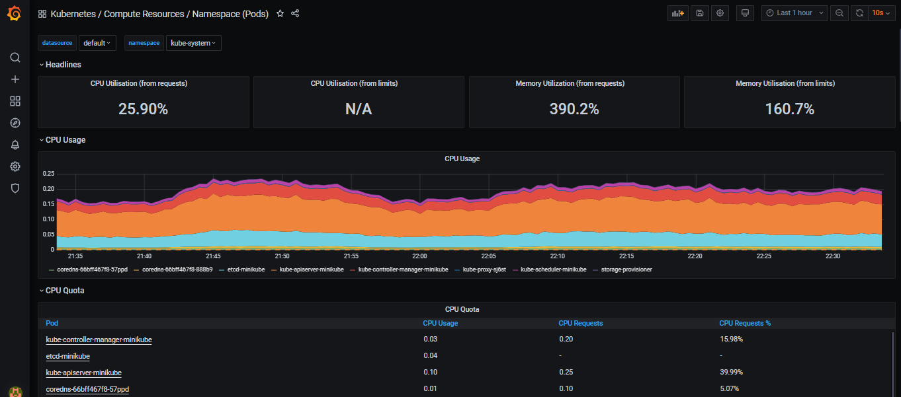

##

**14.** Adicionalmente las métricas del cluster de kubernetes son efectivamente capturadas y se pueden verificar aqui:


##

**15.** El siguiente es un  ejemplo de un dashboard que cree utilizando una métrica del cluster de kubernetes en Graphana:


##
##
##

**Conclusiones**:

- Agregué un probe de tipo readiness para asegura que mi pod esté escucando y funcionando como debe ser.
- Basicamente desplegue los mismos componentes definidos en el punto anterior (con las correcciones mencionadas), el balanceadoer haproxy 
  y el backend gunicorn + flask.

##
##
##
# Trabajo Personal

A continuación les presento algunos repo donde podrán observar el trabajo que he relizado con "cloudformation", "terraform" y con herramientas de testing como "terratest" y "chef ispec":

- https://gitlab.com/jaamarti/tf-modules
- https://gitlab.com/jaamarti/terraform-infra
- https://gitlab.com/jaamarti/aws-infra

##
##
##

