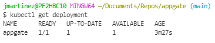

APP GATE TECHINICAL TEST
========================

***** SYSADMIN *****
--------------------

Usted está a cargo de un sistema basado en microservicios en JAVA, con conexiones de base de datos en MongoDB, intercambio de
mensajes con brokers de Kafka y RabbitMQ, y comunicándose por medio de servicios Restful. ¿Que métricas usted considera críticas para monitorear en el sistema y con qué herramientas lo ejecutaría?, justifique su respuesta.

**Respuesta:**

Existen diferentes herramientas sobre las cuales se podría realizar un monitoreo de performance de aplicaciones java contenerizadas en microservicios. Usualmente he trabajo con Dynatrace, CA APM y Newrelic.  Para este caso me voy a enforcar en como realizarlo con NewRelic:

Procedimiento:

Este es un ejemplo de parámetros de configuración que se deberían agregar sobre el archivo Dockerfile con el cual se están desplegando los microservicios java. Básicamente se deben agregar las siguientes líneas:

```python
RUN mkdir -p /usr/local/tomcat/newrelic
ADD ./newrelic/newrelic.jar /usr/local/tomcat/newrelic/newrelic.jar
ENV JAVA_OPTS="$JAVA_OPTS -javaagent:/usr/local/tomcat/newrelic/newrelic.jar -Dnewrelic.config.app_name='MY_APP_NAME'"
ADD ./newrelic/newrelic.yml /usr/local/tomcat/newrelic/newrelic.yml
```

Dada esta configuración, se podrían obtener las siguientes métricas en consola:

- % Memory heap used
- Average response time (ms) / APP
- Invocations per interval / APP
- Error per interval / APP
- SQL queries responses / APP
- NoSQL queries responses / APP

Para monitorear Kafka, se pueden capturar sus métricas con "Prometheus" a través de "JmxExporter" y a su vez se puede realizar una integración  con newrelic o dynatrace y así obtener todos los beneficios de Newrelic hub, logrando tener un monitoreo end-to-end al tener ya instalado el agente para java sobre docker.


#

******* DOCKER + TROUBLESHOOTING *******
------------------------------------

Componentes desplegados en docker fueron los siguientes:

- haproxy
- gunicorn
- flask app

Los archivos de código utilizados (ya corregidos) son los siguientes:


**- Dockerfile**

```python
FROM alpine
RUN apk add py3-pip build-base python3-dev libffi-dev openssl-dev haproxy
RUN mkdir -p /opt/api
WORKDIR /opt/api
ADD api/requirements.txt /opt/api
RUN pip3 install --no-cache-dir -r requirements.txt
ADD api/. /opt/api
ADD ./docker-entrypoint.sh /bin/docker-entrypoint
ADD ./haproxy.conf /etc/haproxy/haproxy.cfg
EXPOSE 80
CMD ["/bin/docker-entrypoint"]
HEALTHCHECK CMD wget -nv -t1 --spider 'http://localhost/' || exit 1
```
**Cambios:**
- Agregué el paquete "haproxy" a los paquetes que se deen instalar con apk
- agregué un HEALTHCHECK para poder capurar en cualquier instante de tiempo el estado del contenedor

##

**- haproxy.conf**
```python
global
   maxconn 8192

defaults
   log stdout format raw local0
   mode http
   option httplog
   option forwardfor
   option httpclose
   option dontlognull

   timeout connect 10s
   timeout client 150s
   timeout server 150s

   maxconn 8192

frontend app-http
   bind *:80

   acl is_app path_beg -i /
   use_backend flask_backend if is_app

backend flask_backend
   server docker-app 127.0.0.1:9000 check verify none
```

**Cambios:**
- Modifiqué el hostname del backend con la ip lookup 127.0.0.1 de tal forma que se puediera evitar el error de no resolución de dns.
- Removí la declaración de los archivos de error. A este punto simplemente es un workaround porque finalmente la solución final es asegurar que existan estos archivos.

##

**- /api/docker-entrypoint.sh**   (script de inicio)

```python
#!/bin/sh
echo "Starting gunicorn..."
cd /opt/api
gunicorn -w 5 -b 127.0.0.1:9000 appgate:app --daemon
sleep 3
echo "Starting haproxy..."
haproxy -f "/etc/haproxy/haproxy.cfg" &
while true; do sleep 1; done
```

**Cambios:**
- Agregué una línea para cambiar al directorio 
- Removí la declaración de los archivos de error. A este punto simplemente es un workaround porque finalmente la solución final es asegurar que existan estos archivos.

##

**- /api/appgate.py**  (código de aplicación backend de flask)

```python
from flask import Flask, jsonify

app = Flask(__name__)

@app.route('/', methods=['GET'])
def hello():
    return "<h1 style='color:blue'>Hello! This is Appgate world!</h1>"

if __name__ == '__main__':
```
##

**- /api/wsgi.py**  (código de aplicación backend de flask)
```python
from appgate import app

if __name__ == "__main__":
        app.run()
```
##


**Procedimiento despliegue docker:**

**1.** Compilación imagen utilizando el dockerfile
```python
docker build -t appgate  .
```

**2.** Lanzamiento de contenedor:
```python
docker run -itd --publish 6060:80 appgate
```

**3.** Listado contenedores activos:
```python
docker ps
```


**4.** Revisión de estado health check
```python
docker inspect --format='{{json .State.Health}}' a2e95d754993
```


**5.** Front end "hello world appgate"


kubectl apply -f deployment.yaml


kubectl expose deployment appgate --type=LoadBalancer --port=4000 --protocol=TCP --target-port=80 --name=appgate-service
